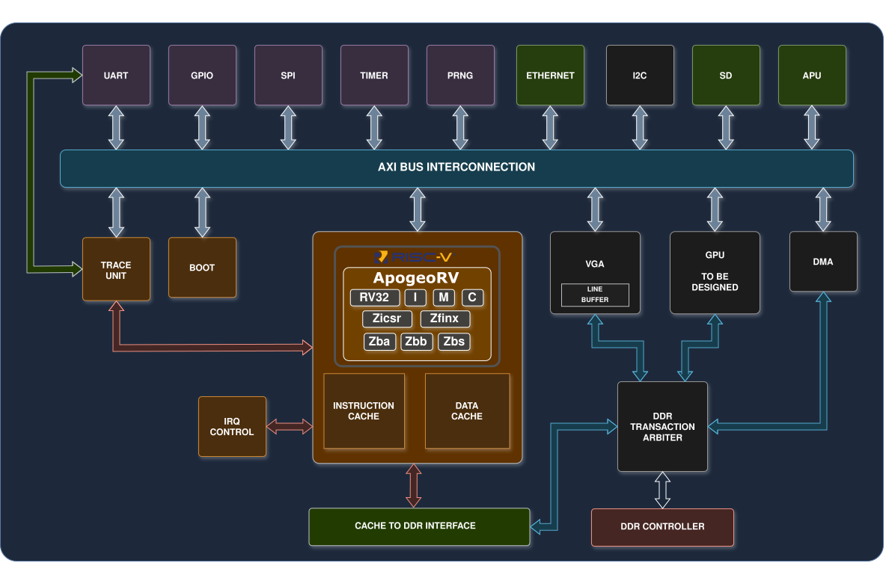

# ZenithSoC

ZenithSoC is a modular 32-bit RISC-V system-on-chip written in SystemVerilog.
It brings together the ApogeoRV CPU, caches, memories, a memory-mapped bus,
bare-metal software, simulation environments, and an FPGA flow in one place.

The project is easiest to explore in this order: build a small firmware image,
run it in the full-SoC Verilator testbench, then move to lockstep
co-simulation or the FPGA flow when the behavior is understood.



## Repository map

* `hw/` — synthesizable SoC RTL. The top level is `hw/ZenithSoC.sv` and its
  source list is `hw/_zenithSoC.f`.
* `hw/cpu/ApogeoRV/` — the imported ApogeoRV core and its own tests/docs.
* `sw/` — drivers, examples, and benchmarks. `sw/benchmark/CoreMark/` is the
  most complete firmware example.
* `tb/verilator/` — the quick full-SoC simulation path.
* `cosim/` — randomized RTL/Spike lockstep verification.
* `vp/` — focused virtual-platform tests for individual peripherals.
* `fpga/nexys_a7/` — the Nexys A7 Vivado build and simulation flow.
* `docs/` — the Sphinx documentation source.

The current integrated top level contains ApogeoRV, instruction and data
caches, boot/on-chip/DDR memory paths, UART, SPI, Ethernet, SD, GPIO, timer,
PRNG, tracing, and audio capture/synthesis. VGA RTL is present but is not
connected to the current SoC top level.

## Prerequisites

The simulation and firmware flows expect a RISC-V cross compiler, Verilator,
and (for co-simulation and VP tests) a local Spike build. Source the shared
environment before using those tools:

```bash
source setenv.sh
```

The script discovers the default tool locations and exports the project and
Spike paths. Override `RISCV_GCC`, `VERILATOR`, or the Spike variables when
your tools live elsewhere.

## Build and run firmware

CoreMark is the reference end-to-end firmware project. From the repository
root:

```bash
source setenv.sh
make -C sw/benchmark/CoreMark sim
```

That produces a firmware ELF for DDR and a small boot-ROM ELF. Run them in the
fast full-SoC Verilator testbench:

```bash
make -C tb/verilator run \
    DDR=../../sw/benchmark/CoreMark/out/coremark_sim.elf \
    BOOT=../../sw/benchmark/CoreMark/out/boot_rom.elf
```

Useful testbench options are `WAVE=1` for an FST waveform, `TRACE=0` to mute
the instruction trace, `TRACE_START=N` to delay trace output, and
`MAX_CYCLES=N` to stop a long-running simulation. See
[`tb/verilator/README.md`](tb/verilator/README.md) for all options.

The direct simulation path loads both ELF files into the testbench. Hardware
booting uses the bootloader in ROM to read an application image from the SD
card, copy it to DDR at `0x8000_0000`, and jump to it. Build those artifacts
with:

```bash
make -C sw/benchmark/CoreMark sd
make -C sw/benchmark/CoreMark fpga
```

The SD image can be written with `tools/write_sd.sh`. Check the target device
carefully before using a command that writes to a block device:

```bash
sudo tools/write_sd.sh /dev/sdX sw/benchmark/CoreMark/out/coremark_app.bin
```

The Verilator testbench can also model the SD boot path:

```bash
make -C tb/verilator run \
    DDR=../../sw/benchmark/CoreMark/out/coremark_app.elf \
    BOOT=../../sw/benchmark/CoreMark/out/bootloader.elf \
    SD=../../sw/benchmark/CoreMark/out/coremark_app.bin \
    SD_BLOCK=0x2000
```

Embench-IoT uses the same direct-simulation style for a collection of smaller
benchmarks:

```bash
make -C sw/benchmark/Embench-IoT sim
```

## Verification flows

CPU and memory-system lockstep against Spike:

```bash
source setenv.sh
make -C cosim info
make -C cosim run-notrace SEED=0 N=2000
make -C cosim regress N=100 JOBS=4
```

The generator unit tests can be run without building the simulator:

```bash
python3 -m unittest discover -s cosim/gen/tests -v
```

For a peripheral-focused test, choose a block such as `uart`, `spi`, `timer`,
or `sd`:

```bash
make -C vp info BLOCK=uart
make -C vp run-notrace BLOCK=uart
```

## FPGA flow

The supported board flow targets a Nexys A7 DDR 100T and requires Vivado:

```bash
make -C fpga/nexys_a7 bitstream
```

The default boot image comes from CoreMark. To use another bootloader, pass an
absolute path with `BOOTLOADER_HEX`. Once a base bitstream exists, changing
only the boot program does not require synthesis again:

```bash
make -C fpga/nexys_a7 update-bootloader \
    BOOTLOADER_ELF=/absolute/path/to/bootloader.elf
```

The board README contains the synthesis, implementation, XSim, waveform, and
UpdateMEM targets.

## Documentation

Build the Sphinx site with:

```bash
python3 -m pip install -r docs/requirements.txt
make -C docs SPHINXOPTS=-W html
```

Open `docs/_build/html/index.html`. The architecture guide starts at
[`docs/architecture/overview.rst`](docs/architecture/overview.rst), and the
current ApogeoRV integration is described in
[`docs/cpu/apogeo.rst`](docs/cpu/apogeo.rst), with links to the upstream
microarchitecture documentation.

## Hardware source of truth

For architecture and interface changes, begin with `hw/ZenithSoC.sv`,
`hw/cpu/cpu_complex.sv`, `hw/utils/pkg/soc_parameters.sv`, and the relevant
file list. Register packages and RTL determine the actual address map. Keep a
focused simulation or software test beside every hardware change, and keep
generated output in the ignored `out/`, `obj_dir/`, log, waveform, and
`docs/_build/` directories.

Third-party components, including ApogeoRV and the benchmark trees, retain
their own license files. Preserve those terms when redistributing the
repository.
