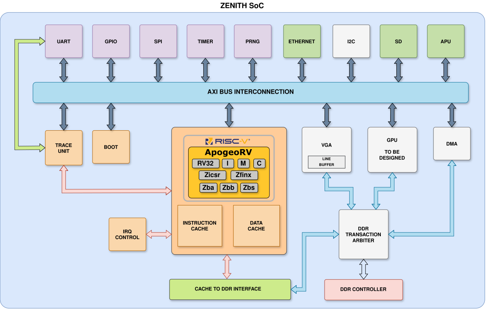

Architecture at a glance
========================

ZenithSoC is a small 32-bit RISC-V system built around the ApogeoRV core. The design is aimed at
FPGA systems, but the RTL is kept modular enough to make simulation and block
level experiments straightforward.

The useful way to think about the system is as three layers:

* **ApogeoRV** fetches, schedules, executes, and retires instructions.
* **The CPU complex** connects the core to the boot ROM, the instruction and
  data caches, DDR, and the MMIO bus.
* **The SoC top level** instantiates the bus endpoints, interrupt controller,
  memories, clocking, and board-facing interfaces.

The complete integration is visible in ``hw/ZenithSoC.sv`` and its source list
``hw/_zenithSoC.f``. When a page disagrees with those files or with the shared
packages under ``hw/utils/pkg/``, the RTL wins.

Current data path
-----------------

Instruction fetches start in the ApogeoRV front end. Boot-ROM accesses bypass
the instruction cache; code in the user/DDR region goes through the I-cache.
Data loads and stores go through the D-cache when they address DDR, while
MMIO accesses are sent directly to the bus. The I-cache and D-cache share the
DDR load channel, with data-cache requests taking priority when both sides
need it.

The boot ROM occupies the first 16 KiB of the address space. The bootloader
initializes the platform, loads an application from the SD card when running
on hardware, and transfers control to DDR at ``0x8000_0000``.

What is integrated
------------------

The current top level includes UART, timer, GPIO, SPI, Ethernet, PRNG, APU,
SD, trace, on-chip non-cacheable memory, and the DDR interface. VGA RTL is
present in the repository but is not connected to the current top level; it
has no SoC address or external pins yet. See
:doc:`hardware_status` for the integration boundary and
:doc:`memory_map` for the addresses and interrupt vectors.

Where to go next
----------------

* :doc:`../cpu/cpu_complex` describes the boundary between ApogeoRV, caches,
  memory, and the SoC bus.
* :doc:`memory_map` is the reference for MMIO windows and interrupt indices.
* :doc:`interconnect` describes the shared bus protocol and routing behavior.
* The peripheral and audio pages document the register interfaces used by
  firmware.
